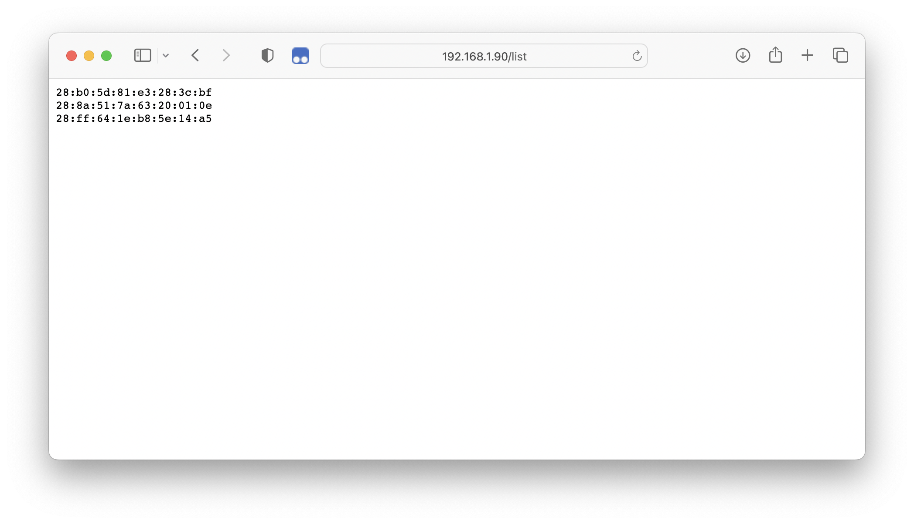
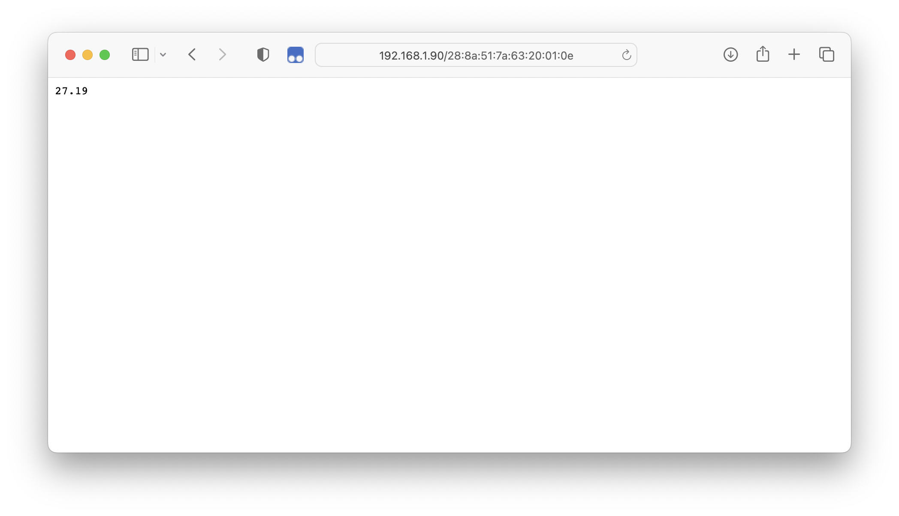

# 1-Wire Gateway for ESP32

This project allows you to easily read the temperature from multiple DS18B20 sensors with an ESP32 via HTTP. 
Its specifically designed to work with Loxone, but will work pretty much with everything that can handle a HTTP GET request.

Just connect a sensor, and grab the data.

## Deployment
1. Clone this repo and open it with PlatformIO.
2. Customize your WiFi SSID and Password in the **<credential.h>** file.
3. Upload the project to your board.
4. Connect your sensors to **Pin4** of your ESP32 board.

Make sure you got a static DHCP reservation, so the IP address of the board doesnt change.

## Usage
You can get a list of all connected sensors. Just open your webbrowser and enter: 
**\"http://\<Address-of-your-ESP32\>/list\"**

To get the sensor reading, just type: **\"http://\<Address-of-your-ESP32\>/\<Sensor-Address\>\"**

## Known limitations
- Currently all sensors needs to be connected in "normal" mode. Parasite is not supported yet.
- There is now way to configure a static IP address. It is always obtained via DHCP.